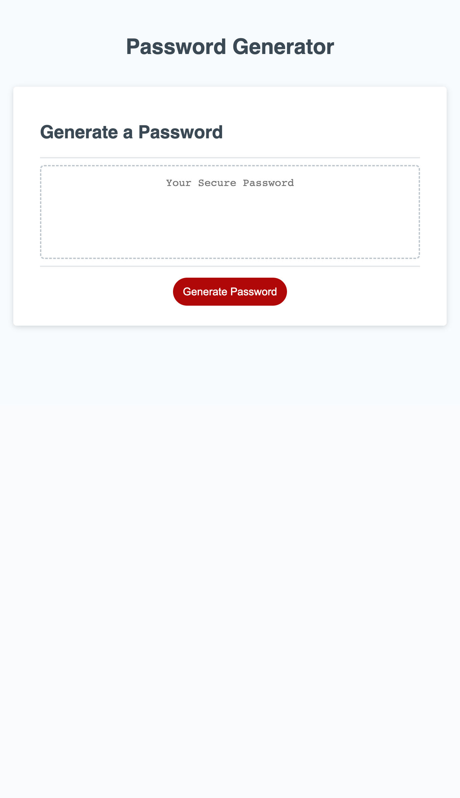

# 03-javascript

## Description

For this project I have modified starter code to create an application that enables employees to generate random passwords based on criteria that they’ve selected. This criteria includes desired password length and character types: lowercase letters, uppercase letters, numbers, and special characters. Having a randomly generated password with different character types prevents hackers from accessing your accounts and private information. 

## Table of Contents (Optional)

- [Installation](#installation)
- [Usage](#usage)
- [Credits](#credits)
- [License](#license)

## Installation

N/A

## Usage

This site contains a working password generator that works based on your chosen criteria. The criteria prompts pops up as alerts when the generate password button is clicked, and you move through the prompts by making selections or entering text. When completed, the password will generate in the box where the text 'your secure password is. Demonstration pictures:

Generate Password Button:

Length Prompt:

Confirm Length:

Character Type Instructions:

Add Lowercase Letters Prompt:

Add Uppercase Letters Prompt:

Add Numbers Prompt: 

Add Special Characters Prompt:

Confirm All Criteria:

Generated Password:

The Finished Site at standard viewport:

The Finished Site at 690px viewport:

The Finished Site at 500px viewport:

Finished Site Link: 

## Credits

N/A

## License

MIT License
